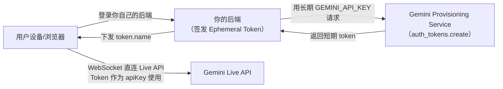
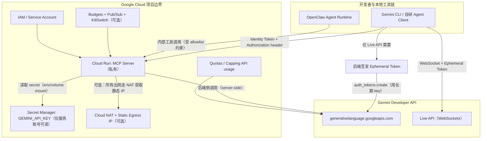
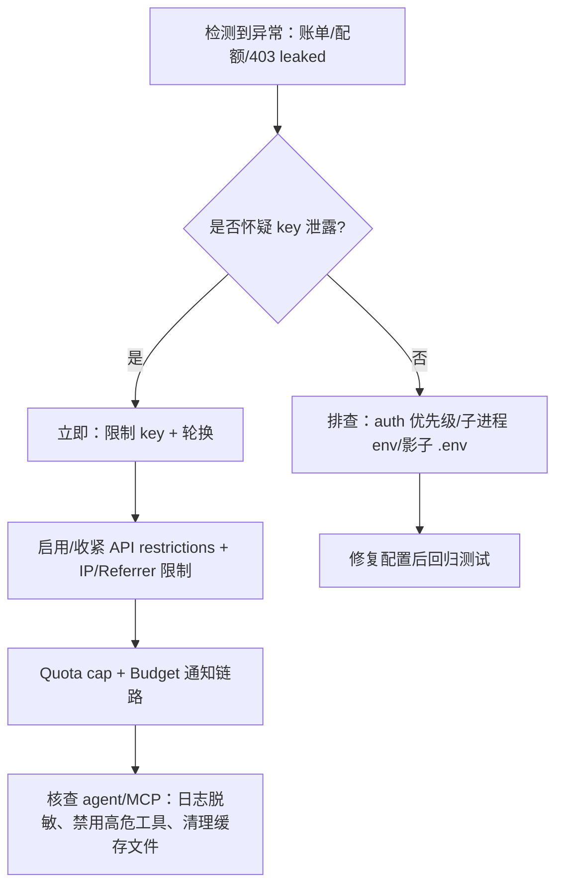

# 2026 年 Gemini API 安全使用最佳实践综述：AI Studio Key、MCP Server 与 OpenClaw/Agent 工具

## 执行摘要

本报告围绕 **2026 年 2–3 月后**出现的真实踩坑与官方最新文档，给出在 **AI Studio（Gemini Developer API）API Key + MCP Server + OpenClaw/Agent 工具链**下“可落地”的安全最佳实践与参考实现。

核心结论如下：Gemini API key 被 Google 明确要求“像密码一样对待”，禁止提交到源码仓库、禁止在浏览器/移动端生产环境直接使用，并要求尽可能对 key 做 **访问限制（IP/Referrer/移动端签名）+ API 限制（仅开启必要 API）+ 定期审计与轮换**；对于必须在客户端直连 Live API 的场景，官方建议改用 **短期的 Ephemeral Token** 替代长期 API key。citeturn7view0turn8view0

在 MCP/Agent 场景中，“密钥安全”只是底线，更大的风险来自“**工具链与代理的授权边界**”：未鉴权的远程 MCP、宽权限工具、默认信任（trust=true）或将机密写入记忆/日志，都可能导致凭据劫持与数据外流。官方 Codelab 已明确提示：Cloud Run 托管 MCP **生产环境必须使用 `--no-allow-unauthenticated`**，并且通过 **Identity Token + IAM** 进行调用授权。citeturn24view0 另一方面，MCP 官方安全最佳实践也强调：MCP Server **必须验证所有入站请求**，并且 **不得用 session 充当认证**（否则极易被会话劫持/事件注入）。citeturn16view0

真实踩坑表明：凭据“泄露/被标记泄露”在 2026 年已经非常现实——例如 OpenClaw 在 Gemini embeddings 场景下出现 **API key 被 Google 标记为 leaked 后返回 403**，但工具端缺少可操作恢复指引，导致团队长时间不可用；另有 OpenClaw bug 会把本应由 Keychain/SecretRef 管理的 key **落盘到 `models.json`**，破坏“密钥不落盘”的设计目标。citeturn27view1turn27view0 这些案例共同指向：必须把 **密钥管理、网络边界、最小权限工具、监控与应急响应**整体做成体系，而不是“把 key 放到环境变量”就结束。

---

## 官方对 Gemini API key 的安全要求

**本节以官方目标文档 “Using Gemini API keys” 为主线，逐条结构化总结。**citeturn7view0

**要点（官方硬性规则与推荐）**

- **API key 与 Google Cloud Project 绑定**：每个 Gemini API key 关联一个 Google Cloud 项目；AI Studio 只是“轻量管理界面”，更完整的限制/管理需到 Cloud Console Credentials 页面执行（包括限制只允许 Generative Language API）。citeturn7view0  
- **把 key 当密码**：一旦泄露，攻击者可能消耗配额、产生账单，并可能访问项目私有数据（官方举例包含“files”等）。citeturn7view0  
- **禁止两类高危行为**  
  - 不要把 key 提交到 Git 等版本控制系统。citeturn7view0  
  - 不要在浏览器/移动端生产环境直接使用 key（包括在浏览器里使用官方 JS/TS 库或 REST 调用），因为客户端代码可被提取。citeturn7view0  
- **必须做限制与治理**  
  - 访问限制：尽可能限制到特定 **IP / HTTP Referrer / Android/iOS 应用**。citeturn7view0turn13view1  
  - API 限制：仅开启必要的 API（减少“被盗后横向滥用”）。citeturn7view0turn13view0  
  - 定期审计与轮换：官方明确建议定期审计并轮换 key。citeturn7view0turn14view0  
- **推荐调用模式**  
  - 最安全：后端侧调用（server-side）。citeturn7view0  
  - 仅在 Live API 的“客户端直连”场景：使用 **Ephemeral Token（短期 token）**替代长期 key；token 可设置短过期时间、限制用途/配置。citeturn7view0turn8view0  

**主要风险（结合官方规则解释攻击面）**

- **源码泄露、日志泄露、客户端反编译**导致 key 被复制后可“即刻重放”（API key 是 bearer credential）。官方因此强调禁止提交仓库、禁止客户端直连。citeturn7view0turn14view0  
- **未限制的 key** 可被“任何人、从任何地方”使用；Google Cloud 文档明确指出“未限制 key 不安全”，生产必须设置 application restrictions + API restrictions。citeturn13view1  
- **查询参数传 key**会把 key 暴露在 URL（易被扫描/缓存/日志记录），官方建议改用 `x-goog-api-key` header 或 client library。citeturn14view0turn7view0  

**缓解措施（对应风险逐一映射）**

- **最小暴露**：只在后端保存 key；前端/agent 只与后端会话交互；如需客户端直连 Live API，用 ephemeral token。citeturn7view0turn8view0  
- **双重限制**：同时做 application restrictions 与 API restrictions；把 key 限定到“仅 generativelanguage API”。citeturn13view1turn7view0  
- **治理闭环**：定期审计（列出所有 key、检查限制与最近使用）、定期轮换、删除不再使用的 key。citeturn7view0turn14view0turn13view1  

**可复制的配置/代码示例**

```bash
# 1) 本地开发：仅通过环境变量注入（避免写入代码/仓库）
export GEMINI_API_KEY="YOUR_API_KEY"
# 或 export GOOGLE_API_KEY="YOUR_API_KEY"（若两者都设，GOOGLE_API_KEY 优先生效）
```

citeturn7view0

```bash
# 2) REST 调用：使用 x-goog-api-key header（避免 URL query 参数暴露 key）
curl "https://generativelanguage.googleapis.com/v1beta/models/gemini-3-flash-preview:generateContent" \
  -H 'Content-Type: application/json' \
  -H "x-goog-api-key: YOUR_API_KEY" \
  -X POST \
  -d '{
    "contents": [{"parts": [{"text": "Explain how AI works in a few words"}]}]
  }'
```

citeturn7view0turn14view0

```bash
# 3) Live API：后端签发 Ephemeral Token（示例：Python，token 默认可用 30 分钟，且可设置 uses=1）
# 注意：Ephemeral Token 目前仅兼容 Live API（v1alpha）
python - <<'PY'
import datetime
from google import genai

now = datetime.datetime.now(tz=datetime.timezone.utc)
client = genai.Client(http_options={'api_version': 'v1alpha'})

token = client.auth_tokens.create(config={
  'uses': 1,
  'expire_time': now + datetime.timedelta(minutes=30),
  'new_session_expire_time': now + datetime.timedelta(minutes=1),
  'http_options': {'api_version': 'v1alpha'},
})
print(token.name)  # 返回给客户端使用（客户端“像 API key 一样”使用它）
PY
```

citeturn8view0turn7view0

**官方链接（本维度关键来源）**

- Using Gemini API keys（包含“Critical security rules / Best practices / API key restrictions / ephemeral tokens”）citeturn7view0  
- Ephemeral tokens（Live API 短期 token 的工作方式、默认时间窗、可锁定配置、最佳实践）citeturn8view0  
- Google Cloud：Manage API keys / Apply API key restrictions / Rotate an API key / Best practices for managing API keys citeturn13view1turn13view0turn14view0  

---

## MCP/Agent 场景安全最佳实践

**本节重点覆盖 server-side、Cloud Run MCP、Secret Manager、身份权限与网络配置，并融入 Gemini CLI / MCP 官方安全建议。**citeturn24view0turn12view0turn16view0turn16view1

**要点（在 MCP/Agent 下的“必须额外做”的事）**

- **密钥永不进入模型上下文**：任何把 API key 作为 prompt、tool 输出、memory 写入、日志文本的做法，都等同于“主动泄露”。MCP 工具返回的内容会被送回模型作为上下文，天然具备“外流通道”。citeturn16view1turn7view0  
- **远程 MCP Server 需要“强鉴权 + 最小暴露”**  
  - Cloud Run 托管 MCP：生产必须 `--no-allow-unauthenticated`，用 IAM + Identity Token 访问。citeturn24view0  
  - MCP 规范侧：Server 必须验证所有入站请求，且不应把 session 当认证；否则易被 session hijack / event injection。citeturn16view0  
- **工具最小权限（Tool Allowlist）是 agent 安全的核心控制面**  
  - Gemini CLI 对 MCP server 支持 allowlist：`mcp.allowed`、server 配置中的 `includeTools` / `excludeTools`、`trust=false` 默认要求确认。citeturn16view1  
  - 对“高危工具”（exec、shell、写文件、网络访问）默认人工确认/审批，绝不全局 trust。citeturn16view1turn16view0  
- **凭据存储要体系化**  
  - Cloud Run 注入 secrets：通过 Secret Manager 挂载为环境变量或文件；不要把 key 写进镜像、IaC 明文、settings.json。citeturn12view0  
  - 本地（Gemini CLI extensions）：官方提供“敏感设置写入系统 Keychain，而非明文文件”的机制；同时也存在“Keychain 不可用”环境要提前设计替代方案。citeturn26view1turn26view0turn25view0  

**主要风险（MCP/Agent 特有）**

- **Prompt Injection → 工具滥用**：攻击者诱导模型调用 MCP 工具读取本地文件/执行命令/发网请求/回传敏感信息。MCP 官方安全文档对“本地 MCP server 被恶意启动命令植入/沙箱不足/敏感目录访问”等风险给出了明确描述。citeturn16view0  
- **未鉴权远程 MCP 被任何人调用**：一旦 Cloud Run 公开（allow unauthenticated）且 MCP 内部鉴权薄弱，极易被扫描并被滥用（消耗配额/窃取数据/执行工具）。官方 codelab 直接将其标注为生产禁用项。citeturn24view0turn12view2  
- **环境变量/配置层级“阴影覆盖（shadowing）”**：agent/extension 作为子进程启动时可能拿不到你以为的 env；或者被本地 `.env` / `~/.gemini/settings.json` 覆盖，导致错误 key 被用、或 key 被写入不安全位置。citeturn31view0turn12view0  

**缓解措施（可操作落地）**

- **Cloud Run 托管 MCP 的“推荐基线”**  
  - Private service：`--no-allow-unauthenticated` + `roles/run.invoker` 授权到指定主体（用户/服务账号）。citeturn24view0turn12view2  
  - Ingress 分层：结合 Cloud Run ingress setting 与 IAM（官方建议 layered approach）。citeturn12view1turn12view2  
  - Secret Manager：仅让 Cloud Run 服务账号具备读取 secret 的权限，并通过 Cloud Run secrets 注入。citeturn12view0  
- **MCP Server 侧“认证与会话安全”**  
  - 认证：所有入站请求必须验证（Authorization header / mTLS / IAP 等）；不要用 session 作为认证。citeturn16view0  
  - 会话 ID：使用安全随机；必要时绑定 user_id；可设置过期/轮换。citeturn16view0  
- **Gemini CLI / MCP client 侧“默认不信任”**  
  - `trust=false`；对远程 server 设置 tool allowlist（`includeTools`），并对高危工具强制确认。citeturn16view1turn24view0  
  - Extension settings：敏感设置标记 `sensitive:true`，让 key 进入系统 Keychain，避免落盘明文。citeturn25view0turn26view1  

**可复制的配置/代码示例**

```bash
# A) Cloud Run 部署 MCP Server：生产必须禁用匿名访问
gcloud run deploy gcs-mcp-server \
  --no-allow-unauthenticated \
  --region=us-central1 \
  --source=.
```

citeturn24view0

```bash
# B) 授权调用者（示例：给当前用户授予 Cloud Run Invoker）
export GOOGLE_CLOUD_PROJECT=$(gcloud config get-value project)

gcloud projects add-iam-policy-binding "$GOOGLE_CLOUD_PROJECT" \
  --member="user:$(gcloud config get-value account)" \
  --role="roles/run.invoker"

# 生成 Identity Token（作为 MCP client 调用 Cloud Run 的 Bearer token）
export ID_TOKEN=$(gcloud auth print-identity-token)
```

citeturn24view0

```json
// C) Gemini CLI 连接 Cloud Run MCP（HTTP streaming）：用 Identity Token 做 Authorization
{
  "mcpServers": {
    "my-cloudrun-server": {
      "httpUrl": "https://YOUR_CLOUD_RUN_SERVICE_URL/mcp",
      "headers": {
        "Authorization": "Bearer $ID_TOKEN"
      },
      "trust": false,
      "includeTools": ["create_bucket", "list_buckets"]
    }
  }
}
```

citeturn24view0turn16view1

```bash
# D) Cloud Run 注入 Secret Manager 的 secret 作为环境变量
# （将 secret 暴露为 ENV_VAR_NAME；版本可用 latest 或具体数字）
gcloud run deploy SERVICE \
  --image IMAGE_URL \
  --update-secrets=GEMINI_API_KEY=SECRET_NAME:latest
```

citeturn12view0

```json
// E) Gemini CLI Extension：声明敏感设置（sensitive:true），让 key 存系统 Keychain，并注入 MCP 子进程 env
{
  "name": "mcp-server-example",
  "version": "1.0.0",
  "settings": [
    {
      "name": "API Key",
      "description": "The API key for the service.",
      "envVar": "MY_SERVICE_API_KEY",
      "sensitive": true
    }
  ],
  "mcpServers": {
    "nodeServer": {
      "command": "node",
      "args": ["${extensionPath}${/}example.js"],
      "cwd": "${extensionPath}"
    }
  }
}
```

citeturn25view0turn26view1

**官方链接（本维度关键来源）**

- Cloud Run MCP Codelab（明确 `--no-allow-unauthenticated` + Identity Token + invoker 授权示例）citeturn24view0  
- Cloud Run secrets（Secret Manager 注入 env/volume 的官方步骤）citeturn12view0  
- MCP 安全最佳实践（认证、会话劫持防护、本地 MCP server 风险与沙箱要求）citeturn16view0  
- Gemini CLI MCP server 配置（allowlist、trust、includeTools/excludeTools 等）citeturn16view1  
- Gemini CLI extension settings（敏感配置写 Keychain）citeturn26view1turn25view0  

---

## 防止 hijacking 与 leaked credentials 的组合策略

本节按“最有效控制面”从 **预防 → 限损 → 恢复**组织，并给出优缺点与实施步骤；其中部分能力仅适用于 Vertex AI（IAM/VPC-SC），部分适用于 API key（AI Studio key）。citeturn7view0turn13view1turn15view0turn18view1turn11view0

**要点（高优先级控制面）**

- **API key 的“双重限制”是最直接的止血**：application restrictions（IP/Referrer/移动端）+ API restrictions（只允许必要 API）。citeturn13view1turn13view0turn7view0  
- **Key rotation 必须制度化**：定期轮换可降低“已泄露但未被发现”的风险窗口；Cloud Console 支持 rotate 流程。citeturn13view1turn7view0turn14view0  
- **Spend cap 不能只靠预算提示**：官方明确说明 Budget **不会自动封顶**；如要“硬止损”，需要结合 quota cap 或基于预算通知 **程序化禁用计费**（但有副作用）。citeturn15view0turn18view1turn15view1  
- **短期 token 能显著降低“客户端泄露”后果**  
  - Live API：Ephemeral Token（短期、可限制 uses/配置）。citeturn8view0turn7view0  
  - 更强控制：OAuth（Gemini Developer API）或 IAM（Vertex AI），用短期访问 token 替代长期 key。citeturn9view0turn10view0turn29view1  
- **VPC Service Controls（VPC-SC）对“数据外流”是企业级强控制**：将 Vertex AI 纳入 service perimeter 后，默认阻断来自公网的访问，必须 allowlist 才能调用；并明确覆盖 “Gemini models”。citeturn11view0  

**防护措施对比表（优缺点 + 适用面）**

| 防护措施 | 主要防护对象 | 优点 | 缺点/代价 | 适用于 AI Studio key | 适用于 Vertex AI |
|---|---|---|---|---|---|
| API restrictions（只允许 generativelanguage） | 泄露后横向滥用 | 实现快、收益高 | 需要维护（新增 API 时更新） | ✅citeturn7view0turn13view0 | 部分（Vertex 侧更推荐 IAM）citeturn29view1 |
| IP allowlist（application restrictions） | 泄露后“异地调用” | 对后端服务有效、阻断面清晰 | Cloud Run 默认出网 IP 动态，需静态出网 IP 才好用citeturn18view0turn13view1 | ✅ | ✅（但 Vertex 更常用 IAM+VPC） |
| HTTP Referrer allowlist | Web 前端盗用 | 对浏览器来源限制简单 | Referrer 可被绕过/缺失（策略差异）；仍不建议生产前端直接用 keyciteturn13view1turn7view0 | ⚠️（仅限低风险场景） | ⚠️ |
| Key rotation | 已泄露 key 的“时间窗口” | 降低长期暴露风险 | 需要流程化发布与回滚 | ✅citeturn7view0turn13view1 | ✅（更建议用短期 token）citeturn10view0 |
| Quota cap（capping API usage） | 账单/配额爆炸 | 最直接限损手段之一 | 配额有延迟、不够精确；需留 bufferciteturn18view1 | ✅ | ✅ |
| Budget + 程序化禁用计费 | 成本硬止损（项目级） | 可实现“硬停机” | 关闭计费会关停项目资源，可能不可逆；仍可能有账单延迟citeturn15view1turn15view0 | ✅（项目级） | ✅ |
| Ephemeral Token（Live API） | 客户端泄露 | 短期、可限制、降低泄露后果 | 仅 Live API 支持；仍需安全后端签发citeturn8view0 | ✅（Live API） | ❌ |
| OAuth / IAM（短期 token） | 凭据被复制重放 | 更强访问控制、可撤销/可审计 | 实施复杂度更高 | ✅（Gemini OAuth）citeturn9view0 | ✅（服务账号/ADC）citeturn10view0 |
| VPC Service Controls | 数据外流、越界访问 | 企业级强边界；阻断公网访问citeturn11view0 | 设计/运维复杂；对依赖公网/第三方会受限 | ❌ | ✅citeturn11view0 |

**实施步骤（按“先快后强”给出可执行路径）**

- **第一阶段：API key 立即止血（当日可完成）**  
  1) 对所有 Gemini key 执行 API restrictions（至少限制到 Generative Language API）。citeturn7view0turn13view1  
  2) 如果调用方是固定后端（Cloud Run / VM / NAT 出口），加 IP allowlist；如 Cloud Run 需要静态出网 IP，先按官方文档配置 Cloud NAT + `--vpc-egress=all-traffic`。citeturn18view0turn13view1  
  3) 删除不再用的 key；避免“陈年 key”成为隐患。citeturn14view0turn7view0  

- **第二阶段：限损（1–2 天）**  
  1) 配额封顶（quota cap），并留出延迟 buffer（官方提示 quota enforcement 有延迟）。citeturn18view1  
  2) 建立 Budget + Pub/Sub 通知，必要时触发 Cloud Run Function 禁用计费（官方给出教程与风险警告）。citeturn15view0turn15view1turn15view2  

- **第三阶段：替换长期凭据（中期改造）**  
  - Live API 客户端直连：改用 Ephemeral Token 签发服务，客户端不再接触长期 key。citeturn8view0turn7view0  
  - 企业/高合规：迁移到 Vertex AI（IAM + VPC-SC），把公网访问与数据外流控制纳入 perimeter。citeturn29view1turn11view0turn10view0  

**可复制的配置/代码示例**



citeturn8view0turn7view0

```bash
# Cloud Run 获取静态出网 IP（用于对 API key 做 IP allowlist 的前提条件）
# 核心思路：Direct VPC egress / VPC connector + Cloud NAT + 预留静态 IP
# 关键点：Cloud Run 默认出网 IP 是动态池，需要按此文档改造为静态出网
# （以下仅示例关键命令骨架，细节以官方步骤为准）

# 1) 创建 Cloud Router
gcloud compute routers create ROUTER_NAME --network=NETWORK_NAME --region=REGION

# 2) 预留静态 IP
gcloud compute addresses create ORIGIN_IP_NAME --region=REGION

# 3) 创建 Cloud NAT，绑定静态 IP
gcloud compute routers nats create NAT_NAME \
  --router=ROUTER_NAME \
  --region=REGION \
  --nat-custom-subnet-ip-ranges=SUBNET_NAME \
  --nat-external-ip-pool=ORIGIN_IP_NAME

# 4) 部署 Cloud Run，并把所有 egress 走 VPC（才能稳定出网 IP）
gcloud run deploy SERVICE_NAME \
  --image=IMAGE_URL \
  --network=NETWORK \
  --subnet=SUBNET \
  --region=REGION \
  --vpc-egress=all-traffic
```

citeturn18view0

```bash
# 预算不会自动封顶；如要“硬停机”，可基于预算通知自动 disable billing（官方教程）
# 注意：会关停项目所有资源，可能导致不可逆后果
# 触发链：Budget -> Pub/Sub -> Cloud Run function -> Cloud Billing API
```

citeturn15view0turn15view1turn15view2

**官方链接（本维度关键来源）**

- API key 安全规则 + “Restrict access / Restrict usage / audit & rotate”citeturn7view0  
- API key restrictions（应用限制/API 限制、未限制 key 不安全、轮换流程）citeturn13view1turn13view0turn14view0  
- Cloud Run 静态出网 IP（Direct VPC egress + Cloud NAT）citeturn18view0  
- Budget 不封顶 + 程序化禁用计费 + 风险提示citeturn15view0turn15view1turn15view2  
- Quota cap（配额延迟提示、per-user quotaUser 等）citeturn18view1  
- VPC Service Controls with Vertex AI（perimeter 阻断公网访问，覆盖 Gemini models）citeturn11view0  

---

## AI Studio key 与 Vertex AI 的差异与迁移

**本节给出“差异对照 + 迁移步骤 + 兼容性注意点 + 迁移脚本骨架”。**citeturn29view1turn29view0turn6view0turn10view0turn6search14

**要点（官方定义的两条产品线）**

- Google 明确区分两条 API：**Gemini Developer API（AI Studio/快速上手）** 与 **Vertex AI Gemini API（企业控制）**；并强调二者已可通过统一的 Google Gen AI SDK 访问与迁移。citeturn29view0turn6search9  
- Vertex AI 官方迁移文档给出了差异表，涉及 endpoint、认证、合规、数据驻留、网络与企业支持等。citeturn29view1  

**差异对照表（AI Studio key vs Vertex AI）**

| 维度 | Gemini API（AI Studio / Developer API） | Vertex AI Gemini API |
|---|---|---|
| Endpoint | `generativelanguage.googleapis.com`citeturn29view1 | `aiplatform.googleapis.com`citeturn29view1 |
| 认证 | API key 或 OAuth（连接到 GCP 项目时）citeturn29view1turn9view0 | GCP 服务账号/IAM（ADC 等）citeturn29view1turn10view0 |
| 安全/治理 | key 认证为主；需要自行做 key 限制与治理citeturn7view0turn29view1 | IAM +（可选）VPC/企业能力增强citeturn29view1turn11view0 |
| 合规与治理能力 | 官方注明“无合规认证（示例 HIPAA/SOC2）”，受监管客户建议用 Vertex AIciteturn29view1 | 支持合规、数据驻留、CMEK、Access Transparency 等citeturn29view1 |
| UI | Google AI Studiociteturn29view1 | Vertex AI Studiociteturn29view1 |
| 迁移提示 | region 差异、AI Studio 中创建的模型需在 Vertex 重新训练citeturn29view0turn29view1 | 同左 |

**主要风险（为何要迁移/何时不必迁移）**

- 若你需要 **公网隔离、VPC-SC、组织级 IAM、合规与数据驻留**，Developer API 的 API key 模式会让“最小权限”难以做到真正强制，迁移到 Vertex 更合理。citeturn29view1turn11view0turn10view0  
- 但对“快速迭代/轻量上线”的应用，官方仍认为 Developer API 是最快路径；关键在于把 key 治理做成体系。citeturn29view0turn7view0  

**迁移步骤（官方主线 + 可执行细化）**

- **步骤总览（官方）**：  
  1) 决定沿用原 GCP 项目或新建项目；注意 region 支持差异。citeturn29view0turn29view1  
  2) Vertex 侧改用服务账号认证（ADC/Workload Identity 等）。citeturn29view0turn10view0  
  3) 代码侧：同一 Google Gen AI SDK，仅需切换 `vertexai=True`（Python）或 `vertexai: true`（JS）并传 project/location。citeturn29view0turn6search9  
  4) 如不再使用 Developer API key，按最佳实践删除 key（并知晓删除传播有延迟）。citeturn29view0turn29view1  

- **提示：Prompt/资产迁移**  
  - Vertex 官方提供从 Google Drive 的 AI_Studio 文件夹迁移 prompts 到 Vertex AI Studio 的流程（`.txt` 改为 `.json`）。citeturn29view1  

**兼容性与命名注意点（容易踩坑）**

- Google Gen AI SDK 在 Vertex 侧支持多种 `model` 格式（例如 `publishers/google/models/...` 或 `projects/.../publishers/google/models/...`），而 Developer API 侧多为 `models/...` / `tunedModels/...` 等；混用会导致调用失败或走错后端。citeturn6search14turn29view1  

**示例迁移脚本（可复制骨架）**

```python
# 同一份业务逻辑，切换到 Vertex AI：只改 Client 初始化参数
from google import genai

# Developer API（AI Studio key 模式）
dev_client = genai.Client()
dev_resp = dev_client.models.generate_content(
    model="gemini-3-flash-preview",
    contents="Explain how AI works in a few words",
)
print(dev_resp.text)

# Vertex AI（IAM 模式）
vertex_client = genai.Client(vertexai=True, project="YOUR_PROJECT", location="us-central1")
vertex_resp = vertex_client.models.generate_content(
    model="gemini-3-flash-preview",
    contents="Explain how AI works in a few words",
)
print(vertex_resp.text)
```

citeturn29view0

```bash
# 迁移后清理：不再使用的 Developer API key 建议删除（传播有延迟）
#（在 Cloud Console Credentials 中删除；官方也提示可通过 gcloud undelete 恢复已删 key 的窗口期）
```

citeturn29view0turn29view1

**官方链接（本维度关键来源）**

- Gemini Developer API v.s. Vertex AI（统一 SDK、代码对照、迁移考虑）citeturn29view0  
- Vertex：Migrate from Google AI Studio to Vertex AI（差异表 + prompts 迁移 + 删除 key）citeturn29view1  
- Vertex：Authenticate to Vertex AI（ADC、服务账号、Workload Identity 等）citeturn10view0  
- `@google/genai` Models 文档（Vertex vs Gemini API 的 model 命名格式）citeturn6search14  

---

## 真实踩坑案例复盘

本节按用户要求：**每个案例给出时间、来源链接、根因、教训与修复步骤**；并对“官方案例缺失”的条目明确标注。案例覆盖重点：**Gemini key 泄露/被标记泄露、Gemini CLI/MCP 子进程凭据传递、OpenClaw 记忆/密钥落盘与迁移破坏**。citeturn27view2turn28view0turn27view1turn27view0turn26view0turn31view0turn28view1

**案例汇总表**

| 时间（2026） | 组件 | 是否找到官方案例 | 来源 | 问题概述 |
|---|---|---|---|---|
| 2/25 | API key / Gemini | 未找到官方案例 | Truffle Security 博文citeturn27view2 | 启用 Gemini API 后，项目内“原本用于其他服务、甚至公开在网页源码中的 Google API key”可能“静默获得”访问 Gemini 敏感端点的能力（权限回溯扩张）。 |
| 3/12（发现） | Gemini API key | 未找到官方案例 | Reddit r/googlecloud 真实账单事故citeturn28view0 | 小团队发现 Gemini API 被未授权使用，费用飙升至约 12.8 万美元，暂停 API 后仍持续增长一段时间。 |
| 3/26 | OpenClaw memory + Gemini embeddings | 未找到官方案例（但含官方错误返回） | OpenClaw Issue #54912citeturn27view1 | Gemini key 被 Google 标记为 leaked 后，embeddings 403，memory_search 被动 disabled，缺少可操作恢复指引。 |
| 3/4 | OpenClaw SecretRef / keychain | 未找到官方案例 | OpenClaw Issue #34335citeturn27view0 | 本应由 SecretRef/keychain 管理的 key 被持久化进 `models.json`（明文落盘），并被 merge 逻辑“永久保留”。 |
| 2/12 | Gemini CLI extensions | 官方项目 issue（属于原始来源） | Gemini CLI Issue #18927citeturn26view0 | VM 环境 keychain 不可用，导致敏感配置无法安全存储。 |
| 2/28 | Gemini CLI skill / MCP 子进程 | 官方项目 issue（属于原始来源） | Gemini CLI Issue #20724citeturn31view0 | key 明明在 shell env 中可用，但扩展/子进程拿不到或被优先级逻辑覆盖，引发“无 key”循环报错。 |
| 2/19 | OpenClaw auth profile 迁移 | 未找到官方案例 | OpenClaw Issue #21448citeturn28view1 | 配置字段从 `token` 改为 `key` 且无迁移提示，导致使用 Google/Gemini 的 agent 更新后集体失效。 |

**案例逐条复盘（根因 → 教训 → 修复）**

- **案例：启用 Gemini API 导致“历史 API key 权限回溯扩张”（2/25）**（未找到官方案例）  
  - 根因：Truffle Security 指出 Google API key 格式长期被当作“可公开的项目标识”，但当项目启用 Generative Language API 后，项目内既有 key 可能获得访问 Gemini 端点的能力，且缺少显式告警/确认；默认新 key 也可能是 Unrestricted。citeturn27view2turn13view1  
  - 教训：**“同一项目内复用 key”是高危模式**。一旦你把 Gemini 加进某个“老项目”，必须重新审计该项目里所有历史 key（Maps/Firebase/YouTube 等），否则公开 key 可能被转用为 Gemini 凭据。citeturn27view2turn7view0  
  - 修复：  
    1) 盘点项目内所有 API key，并为每个 key 设置 API restrictions + application restrictions。citeturn13view1turn13view0  
    2) 删除无用 key；对无法判断用途的 key 先停用/轮换。citeturn14view0turn13view1  
    3) 高敏业务迁移到 Vertex AI（IAM + VPC-SC）以获得更强的边界强制能力。citeturn29view1turn11view0  

- **案例：Gemini key 被盗导致巨额费用（3/12 发现，约 12.8 万美元）（未找到官方案例）**  
  - 根因：帖子描述为“未授权使用”；评论区指出预算/异常检测存在延迟，且需要 cost guardrail（quota cap、预算通知触发动作等）才能硬止损。citeturn28view0turn15view0turn18view1  
  - 教训：  
    - **预算不是封顶**，不能指望“设了预算就不会爆账单”。citeturn15view0  
    - 必须有“双保险”：quota cap（限速/限量）+ 预算通知触发自动化动作（例如 disable billing，或最少禁用 API key/服务）。citeturn18view1turn15view1  
  - 修复：  
    1) 立即轮换 key、收紧 restrictions，并启用 quota cap。citeturn13view1turn18view1turn7view0  
    2) 建立预算 + 程序化通知链路；若可接受“项目级停机”，按官方教程自动 disable billing。citeturn15view0turn15view1turn15view2  

- **案例：Gemini key 被标记 leaked 导致 OpenClaw memory_search 失效（3/26）（未找到官方案例，但含官方错误返回）**  
  - 根因：Issue 记录 embeddings 调用返回 403，并包含明确错误信息“Your API key was reported as leaked. Please use another API key.”；同时 OpenClaw 从 `auth-profiles.json` 读取 key，而用户以为改 env 就能生效，导致长期用旧 key。citeturn27view1turn30view1  
  - 教训：  
    - **代理系统往往有自己的“凭据真源”**（auth profile / keychain / secret ref），shell env 只是其中一种输入；必须明确“最终解析点”。citeturn27view1turn16view1  
    - 当 key 被云端标记泄露时，应当在工具层提供“自动修复路径”（指向具体文件/命令），否则会出现长时间不可用。citeturn27view1turn7view0  
  - 修复：按 issue 给出的 workaround，更新 `auth-profiles.json` 中 `google:default.key` 并重启网关。citeturn27view1  

- **案例：SecretRef/keychain 仍导致 key 明文落盘到 models.json（3/4）（未找到官方案例）**  
  - 根因：Issue 指出 `resolveApiKeyFromProfiles` 忽略 exec-source SecretRef，叠加 `models.json` merge 逻辑把历史明文 key 永久保留，导致 key 以明文落盘，且轮换失效。citeturn27view0turn30view2  
  - 教训：  
    - **“不落盘”必须由系统强制保证**，否则一旦出现“历史遗留明文”，就会被各种 merge/缓存机制固化。citeturn27view0turn14view0  
    - 密钥轮换不仅是“换值”，还要清理缓存与派生配置文件。citeturn27view0turn13view1  
  - 修复：按 issue 的 workaround，手工移除 `models.json` 中对应 provider 的 `apiKey` 字段，确保运行时按 SecretRef 动态解析；并结合 `openclaw security audit --fix` 收紧日志脱敏与敏感文件权限。citeturn27view0turn30view2  

- **案例：Gemini CLI 在 VM 环境无法使用 Keychain 存储敏感设置（2/12）（官方项目 issue）**  
  - 根因：Issue 描述“Keychain is not available”，导致敏感配置无法安全落入 Keychain。citeturn26view0turn26view1  
  - 教训：  
    - 你的开发/运行环境可能“不支持 keychain”，因此必须准备替代：例如在 CI/VM 中用 Secret Manager/密文文件挂载（只读、最小权限）、或用短期 token。citeturn12view0turn9view0turn10view0  
  - 修复：优先升级/调整环境使 keychain 可用；不可用时，避免把 key 写入项目目录明文，改用更安全的集中式 secret 注入。citeturn14view0turn12view0  

- **案例：Gemini CLI skill/扩展子进程拿不到 env key，导致“无 key 循环报错”（2/28）（官方项目 issue）**  
  - 根因：Issue 讨论指出 CLI 存在 credential lookup 的优先级与子进程环境隔离问题；并给出修复建议：通过 `gemini extensions config ...` 把 key 写入“安全存储（Keychain）”，绕过 env discovery；同时提到当同时设置 `GOOGLE_API_KEY` 与 `GEMINI_API_KEY` 时会有优先级选择。citeturn31view0turn7view0turn26view1  
  - 教训：  
    - **MCP/extension 子进程≠你的 shell**：即使 `env` 能看到 key，子进程也可能拿不到（或出于安全被剥离）。citeturn31view0turn16view1  
    - “把 key 写进 `.env`/project 目录”会引入 shadowing 与误用风险，必须清晰设计凭据来源层级。citeturn31view0turn26view1  
  - 修复：优先使用官方 extension settings 机制（敏感设置进 Keychain）；并避免同时设置多个 key env 造成优先级误判。citeturn31view0turn26view1turn7view0  

- **案例：OpenClaw 配置字段变更导致 Gemini/Google provider 全面失效（2/19）（未找到官方案例）**  
  - 根因：Issue 指出 `auth-profiles.json` 中 `api_key` 类型从 `token` 变为 `key`，旧字段被静默忽略，无迁移/无 changelog 提示，导致 agent“无响应”。citeturn28view1  
  - 教训：  
    - 代理系统的“认证配置 schema 变更”应当被当作一次高风险发布；需要配置校验、启动前自检、明确报错与自动迁移。citeturn30view2turn16view0  
  - 修复：批量把 `token` 改为 `key`，并为关键配置加入 CI 校验（例如 `openclaw security audit --json`）。citeturn28view1turn30view2  

---

## 推荐的端到端安全架构

本节给出一个“**无特定预算/区域/组织约束**”下、适用于大多数团队的参考架构：**网络边界（Ingress/Egress）+ 身份权限（IAM/Token）+ 密钥管理（Secret Manager/Keychain）+ 监控告警（Quota/Budget）+ 应急响应（Rotate/Disable）+ 工具最小权限（Allowlist）**。citeturn24view0turn12view0turn11view0turn15view0turn16view0turn30view2turn30view1

**架构图（推荐基线）**



citeturn24view0turn12view0turn18view0turn8view0turn7view0turn18view1turn15view0

**关键配置与代码片段（按组件给出可复制示例）**

**Cloud Run（MCP Server）**

```bash
# 1) 私有部署（生产基线）
gcloud run deploy mcp-gateway \
  --no-allow-unauthenticated \
  --region=us-central1 \
  --source=.

# 2) 注入 GEMINI_API_KEY（来自 Secret Manager）
gcloud run services update mcp-gateway \
  --region=us-central1 \
  --update-secrets=GEMINI_API_KEY=gemini-api-key:latest
```

citeturn24view0turn12view0

**MCP server（鉴权与工具最小权限骨架）**

```python
# 伪代码骨架：MCP server 处理前强制鉴权 + 工具 allowlist
#（关键点：验证 Authorization；不要把 session 当认证；只暴露必要工具）

ALLOWED_TOOLS = {"web_search", "generate_summary"}

def handle_request(req):
    auth = req.headers.get("Authorization", "")
    if not auth.startswith("Bearer "):
        raise PermissionError("missing bearer token")

    tool_name = req.json.get("tool")
    if tool_name not in ALLOWED_TOOLS:
        raise PermissionError("tool not allowed")

    # 这里再去调用 Gemini（server-side），不要把 GEMINI_API_KEY 传回模型/客户端
    return call_tool(tool_name, req.json.get("args"))
```

citeturn16view0turn24view0turn7view0

**Gemini CLI（MCP allowlist + 默认不信任）**

```json
{
  "mcp": {
    "allowed": ["my-cloudrun-server"]
  },
  "mcpServers": {
    "my-cloudrun-server": {
      "httpUrl": "https://YOUR_CLOUD_RUN_SERVICE_URL/mcp",
      "headers": { "Authorization": "Bearer $ID_TOKEN" },
      "trust": false,
      "includeTools": ["web_search", "generate_summary"],
      "excludeTools": ["run_shell_command", "write_file"]
    }
  }
}
```

citeturn16view1turn24view0turn16view0

**OpenClaw（限权与“记忆/日志”安全）**

```json
{
  "plugins": {
    "slots": {
      "memory": "none"
    }
  }
}
```

citeturn30view1turn30view3

```json
{
  "agents": {
    "defaults": {
      "compaction": {
        "memoryFlush": {
          "enabled": true,
          "softThresholdTokens": 4000,
          "systemPrompt": "Session nearing compaction. Store durable memories now.",
          "prompt": "Write any lasting notes to memory/YYYY-MM-DD.md; reply with NO_REPLY if nothing to store."
        }
      }
    }
  }
}
```

citeturn30view1turn30view3

```bash
# OpenClaw 安全自检与自动修复（注意：--fix 不会帮你轮换 API key，只会做“确定性安全收紧”）
openclaw security audit --deep
openclaw security audit --fix
```

citeturn30view2

**监控与应急响应（建议流程图）**



citeturn7view0turn13view1turn18view1turn15view0turn31view0turn27view1

**官方链接（本维度关键来源）**

- Cloud Run MCP：私有部署 + Identity Token 调用citeturn24view0  
- Cloud Run secrets：Secret Manager 注入citeturn12view0  
- Cloud Run 静态出网 IP（用于 IP allowlist 场景）citeturn18view0  
- VPC Service Controls（Vertex/Gemini models）citeturn11view0  
- Budget 不封顶 + 程序化禁用计费citeturn15view0turn15view1  
- MCP 安全最佳实践（认证/会话安全/本地 server 沙箱）citeturn16view0  
- OpenClaw memory / security audit（禁用 memory plugin、memoryFlush、日志脱敏与权限收紧）citeturn30view1turn30view2  

---

## 证据范围与局限

- “2026 年 2–3 月后真实案例”中，**官方（Google）直接发布的安全事故通报较少**；本报告按用户要求，对未能在官方文档/公告中找到的案例，已明确标注“未找到官方案例”，并以 GitHub issue、公开社区事故贴、第三方研究作为原始证据补充。citeturn27view2turn28view0turn27view0turn27view1  
- 关于“被标记 leaked 的 key 会被拒绝”的行为，本报告采用了**真实 403 返回报文**作为证据（OpenClaw issue），并将其视为“服务端实际执行的安全策略”，但该策略的完整官方机制说明（例如检测范围、通知方式、申诉流程）在已检索材料中未形成统一、可引用的官方规范文本。citeturn27view1turn7view0